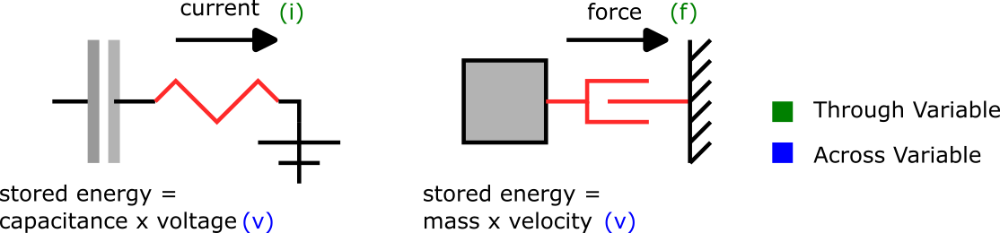

# Introduction

In Physical Network Acausal modeling, each physical domain must define a **connector** to combine model components.  Each physical domain **connector** defines a minimum of 2 variables, one which is called a *Through* variable, and one which is called an *Across* variable.  Both Modelica and SimScape define these variables in the same way:

  - [Modelica Connectors](https://mbe.modelica.university/components/connectors/#acausal-connection)
  - [SimScape Connectors](https://www.mathworks.com/help/simscape/ug/basic-principles-of-modeling-physical-networks.html#bq89sba-6)

However, the standard libraries differ on the selection of the Across variable for the Mechanical Translation and Rotation libraries, Modelica choosing position and angle and SimScape choosing velocity and angular velocity, respectively for Translation and Rotation.  Modelica describes their decision [here](https://mbe.modelica.university/components/connectors/simple_domains/).  In summary, they would like to provide less integration in the model to avoid lossy numerical behavior, but this decision assumes the lowest order derivative is needed by the model.  Numerically it is possible to define the connector either way, but there are some consequences of this decision, and therefore we will study them in detail here as they relate to ModelingToolkit.

# Through and Across Variable Theory

### General

The idea behind the selection of the **through** variable is that it should be a time derivative of some conserved quantity. The conserved quantity should be expressed by the **across** variable.  In general terms, the physical system is given by

  - Energy Dissipation & Flow:

```math
\begin{aligned}
    \partial {\color{blue}{across}} / \partial t \cdot c_1 = {\color{green}{through}}  \\
    {\color{green}{through}} \cdot c_2 = {\color{blue}{across}}
\end{aligned}
```

### Electrical

For the Electrical domain, the across variable is *voltage* and the through variable *current*.  Therefore

  - Energy Dissipation:

```math
\partial {\color{blue}{voltage}} / \partial t \cdot capacitance = {\color{green}{current}}
```

  - Flow:

```math
{\color{green}{current}} \cdot resistance = {\color{blue}{voltage}}
```

### Translational

For the translation domain, choosing *velocity* for the across variable and *force* for the through gives

  - Energy Dissipation:

```math
\partial {\color{blue}{velocity}} / \partial t \cdot mass = {\color{green}{force}}
```

  - Flow:

```math
{\color{green}{force}} \cdot (1/damping) = {\color{blue}{velocity}}
```

The diagram here shows the similarity of problems in different physical domains.



### Translational Connector using *Position* Across Variable

Now, if we choose *position* for the across variable, a similar relationship can be established, but the pattern must be broken.

  - Energy Dissipation:

```math
\partial^2 {\color{blue}{position}} / \partial t^2 \cdot mass = {\color{green}{force}}
```

  - Flow:

```math
{\color{green}{force}} \cdot (1/damping) = \partial {\color{blue}{position}} / \partial t
```

As can be seen, we must now establish a higher order derivative to define the Energy Dissipation and Flow equations, requiring an extra equation, as will be shown in the example below.

# Examples

### Electrical Domain

We can generate the above relationship with ModelingToolkit and the ModelingToolkitStandardLibrary using 3 blocks:

  - Capacitor: for energy storage with initial voltage = 1V
  - Resistor: for energy flow
  - Ground: for energy sink

As can be seen, this will give a 1 equation model matching our energy dissipation relationship

```@example connections
using ModelingToolkitStandardLibrary.Electrical, ModelingToolkit, OrdinaryDiffEq
using ModelingToolkit: t_nounits as t
using Plots

systems = @named begin
    resistor = Resistor(R = 1)
    capacitor = Capacitor(C = 1)
    ground = Ground()
end

eqs = [connect(capacitor.p, resistor.p)
       connect(resistor.n, ground.g, capacitor.n)]

@named model = System(eqs, t; systems)

sys = mtkcompile(model)

println.(equations(sys))
nothing # hide
```

The solution shows what we would expect, a non-linear dissipation of voltage and related decrease in current flow…

```@example connections
prob = ODEProblem(sys, [1.0], (0, 10.0))
sol = solve(prob)

p1 = plot(sol, idxs = [capacitor.v])
p2 = plot(sol, idxs = [resistor.i])
plot(p1, p2)
```

### Mechanical Translational Domain

#### Across Variable = velocity

Now using the Translational library based on velocity, we can see the same relationship with a system reduced to a single equation, using the components:

  - Body (i.e. moving mass): for kinetic energy storage with an initial velocity = 1m/s
  - Damper: for energy flow
  - Fixed: for energy sink

```@example connections
using ModelingToolkitStandardLibrary
const TV = ModelingToolkitStandardLibrary.Mechanical.Translational

systems = @named begin
    damping = TV.Damper(d = 1)
    body = TV.Mass(m = 1)
    ground = TV.Fixed()
end

eqs = [connect(damping.flange_a, body.flange)
       connect(ground.flange, damping.flange_b)]

@named model = System(eqs, t; systems)

sys = mtkcompile(model)

println.(full_equations(sys))
nothing # hide
```

As expected, we have a similar solution…

```@example connections
prob = ODEProblem(
    sys, [], (0, 10.0); initialization_eqs = [sys.body.s ~ 0, sys.body.v ~ 1])
sol_v = solve(prob)

p1 = plot(sol_v, idxs = [body.v])
p2 = plot(sol_v, idxs = [damping.f])
plot(p1, p2)
```

#### Across Variable = position

Now, let's consider the position-based approach.  We can build the same model with the same components.  As can be seen, we now end of up with 2 equations, because we need to relate the lower derivative (position) to force (with acceleration).

```@example connections
const TP = ModelingToolkitStandardLibrary.Mechanical.TranslationalPosition

systems = @named begin
    damping = TP.Damper(d = 1)
    body = TP.Mass(m = 1, v = 1)
    ground = TP.Fixed(s_0 = 0)
end

eqs = [connect(damping.flange_a, body.flange)
       connect(ground.flange, damping.flange_b)]

@named model = System(eqs, t; systems)

sys = mtkcompile(model)

println.(full_equations(sys))
nothing # hide
```

As can be seen, we get exactly the same result.  The only difference here is that we are solving an extra equation, which allows us to plot the body position as well.

```@example connections
prob = ODEProblem(sys, [], (0, 10.0), fully_determined = true)
sol_p = solve(prob)

p1 = plot(sol_p, idxs = [body.v])
p2 = plot(sol_p, idxs = [damping.f])
p3 = plot(sol_p, idxs = [body.s])

plot(p1, p2, p3)
```

The question then arises, can the position be plotted when using the Mechanical Translational Domain based on the Velocity Across variable?  Yes, we can!  There are 2 solutions:

 1. the `Mass` component will add the position variable when the `s` parameter is used to set an initial position. Otherwise, the component does not track the position.

```julia
@named body = TV.Mass(m = 1, v = 1, s = 0)
```

 2. implement a `PositionSensor`
    TODO: Implement Translation Sensors

Either option will produce the same result regardless of which across variable is used.  If the same result is given, why are both options included in the Standard Library, what are the differences?  These differences will be discussed next so that an informed decision can be made about which domain is best for your model.

# Mechanical/Translational Library Differences (Velocity vs. Position Connectors)

## Initialization

The main difference between `ModelingToolkitStandardLibrary.Mechanical.Translational` and `ModelingToolkitStandardLibrary.Mechanical.TranslationalPosition` is how they are initialized.  In the `ModelingToolkitStandardLibrary` initialization, parameters are defined at the component level, so we simply need to be careful to set the correct initial conditions for the domain that it used.  Let's use the following example problem to explain the differences.


In this problem, we have a mass, spring, and damper which are connected to a fixed point.  Let's see how each component is defined.

#### Damper

The damper will connect the flange/flange 1 (`flange_a`) to the mass, and flange/flange 2 (`flange_b`) to the fixed point.  For both position- and velocity-based domains, we set the damping constant `d=1` and `va=1` and leave the default for `v_b_0` at 0.

```@example connections
@named dv = TV.Damper(d = 1)
@named dp = TP.Damper(d = 1)
nothing # hide
```

#### Spring

The spring will connect the flange/flange 1 (`flange_a`) to the mass, and flange/flange 2 (`flange_b`) to the fixed point.  For both position- and velocity-based domains, we set the spring constant `k=1`.  The velocity domain then requires the initial velocity `va` and initial spring stretch `delta_s`. The position domain instead needs the natural spring length `l`.

```@example connections
@named sv = TV.Spring(k = 1)
@named sp = TP.Spring(k = 1, l = 1)
nothing # hide
```

#### Mass

For both position- and velocity-based domains, we set the mass `m=1` and initial velocity `v=1`. Like the damper, the position domain requires the position initial conditions set as well.

```@example connections
@named bv = TV.Mass(m = 1)
@named bp = TP.Mass(m = 1, v = 1, s = 3)
nothing # hide
```

#### Fixed

Here the velocity domain requires no initial condition, but for our model to work as defined we must set the position domain component to the correct initial position.

```@example connections
@named gv = TV.Fixed()
@named gp = TP.Fixed(s_0 = 1)
nothing # hide
```

### Comparison

As can be seen, the position-based domain requires more initial condition information to be properly defined, since the absolute position information is required. Therefore, based on the model being described, it may be more natural to choose one domain over the other.

Let's define a quick function to simplify and solve the 2 different systems. Note, we will solve with a fixed time step and a set tolerance to compare the numerical differences.

```@example connections
function simplify_and_solve(damping, spring, body, ground; initialization_eqs = Equation[])
    eqs = [connect(spring.flange_a, body.flange, damping.flange_a)
           connect(spring.flange_b, damping.flange_b, ground.flange)]

    @named model = System(eqs, t; systems = [ground, body, spring, damping])

    sys = mtkcompile(model)

    println.(full_equations(sys))

    prob = ODEProblem(sys, [], (0, 10.0); initialization_eqs, fully_determined = true)
    sol = solve(prob; abstol = 1e-9, reltol = 1e-9)

    return sol
end
nothing # hide
```

Now let's solve the velocity domain model

```@example connections
initialization_eqs = [bv.s ~ 3
                      bv.v ~ 1
                      sv.delta_s ~ 1]
solv = simplify_and_solve(dv, sv, bv, gv; initialization_eqs);
nothing # hide
```

And the position domain model

```@example connections
solp = simplify_and_solve(dp, sp, bp, gp);
nothing # hide
```

Now we can plot the comparison of the 2 models and see they give the same result.

```@example connections
plot(ylabel = "mass velocity [m/s]")
plot!(solv, idxs = [bv.v])
plot!(solp, idxs = [bp.v])
```

But, what if we wanted to plot the mass position?  This is easy for the position-based domain, we have the state `bp₊s(t)`, but for the velocity-based domain we have `sv₊delta_s(t)` which is the spring stretch.  To get the absolute position, we add the spring natural length (1m) and the fixed position (1m).  As can be seen, we then get the same result.

```@example connections
plot(ylabel = "mass position [m]")
plot!(solv, idxs = [sv.delta_s + 1 + 1])
plot!(solp, idxs = [bp.s])
```

So in conclusion, the position based domain gives easier access to absolute position information, but requires more initial condition information.

## Accuracy

One may then ask, what the trade-off in terms of numerical accuracy is. When we look at the simplified equations, we can see that actually both systems solve the same equations.  The differential equations of the velocity domain are

```math
\begin{aligned}
m \cdot \dot{v} +  d \cdot v + k \cdot \Delta s = 0  \\
\dot{\Delta s} = v
\end{aligned}
```

And for the position domain are

```math
\begin{aligned}
m \cdot \dot{v} +  d \cdot v + k \cdot (s - s_{b_0} - l) = 0   \\
\dot{s} = v
\end{aligned}
```

By definition, the spring stretch is

```math
\Delta s = s - s_{b_0} - l
```

Which means both systems are actually solving the same exact system.  We can plot the numerical difference between the 2 systems and see the result is negligible (much less than the tolerance of 1e-9).

```@example connections
plot(title = "numerical difference: vel. vs. pos. domain", xlabel = "time [s]",
    ylabel = "solv[bv.v] .- solp[bp.v]")
time = 0:0.1:10
plot!(time, (solv(time)[bv.v] .- solp(time)[bp.v]), label = "")
```
