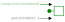

# Sign Convention

A sign convention is recommended for this library that implements the following rule:

> An input component that specifies the *through* variable should be such that an oppossite equality is written such that when connected to a conserved quantity component (i.e. a mass or capacitor component) a positive value for a flow variable represents the accumulation of that conserved quantity over time in the component.

Note: that this implements the same convention as applied in Modelica Standard Library.

For example, the following would be the *correct* sign convention for the `Mechanical.Translational` force variable `f`

```julia
@mtkmodel ConstantForce begin
    @parameters begin
        f = 0
    end
    @components begin
        flange = MechanicalPort()
    end
    @equations begin
        # connectors
        flange.f ~ -f # <-- force is leaving
    end
end
```

And writing the following would be the *incorrect* sign convention.

```julia
@equations begin
    # connectors
    flange.f ~ f # <-- wrong through variable input sign!
end
```

<!-- To visualize the sign convention, one can draw the orientation of the connector port *across* and *through* variables and the subsequent component variables.  For example, the `Mechanical.Translation` mass component would look like



In this case we know from Newton that mass times acceleration equals force, therefore the direction of movement is in the opposite direction of the force.  In other words, if we push the mass from left to right (i.e. in the positive direction), then the mass will generate a force in the negative direction.  This would be the general rule for a single port component of any domain.  The exception is for a *through* variable **input** component, which should align the component and port connection *through* variables.  For example, a force input diagram would look like this:


For a 2 port connection component, then the *through* variable is exiting each connection port in opposing directions.  Using a damper as an example, if the positive direction is to the right, then the force of the damper is pushing left (i.e. in the negative direction) on connection port `a` and right (positive direction) on connection port `b`.

 -->
# Discussion

The energy dissipation equation that governs the acausal connection definitions should be such that a positive *through* variable input will lead to an increasing *across* variable value.

```math
\frac{\partial \blue across}{\partial t} = \text{ {\green through} input}
```

This is demonstrated in the following domains of `Mechanical`, `Electrical`, and `Hydraulic`.

## Mechanical

The flow variable (i.e. force) input component for the `Mechanical` domain is

```@example sign_convention
using ModelingToolkit
using ModelingToolkitStandardLibrary.Mechanical.Translational
using ModelingToolkit: t_nounits as t

@mtkmodel ConstantForce begin
    @parameters begin
        f
    end
    @components begin
        flange = MechanicalPort()
    end
    @equations begin
        # connectors
        flange.f ~ -f
    end
end
```

Here we can see that a positive input force results in an increasing velocity.

```@example sign_convention
@mtkmodel Model begin
    @components begin
        mass = Mass(; m = 10)
        force = ConstantForce(; f = 1)
    end
    @equations begin
        connect(mass.flange, force.flange)
    end
end
@mtkcompile sys = Model()
full_equations(sys)
```

## Electrical

The flow variable (i.e. current) input component for the `Electrical` domain is

```@example sign_convention
using ModelingToolkitStandardLibrary.Electrical

@mtkmodel ConstantCurrent begin
    @parameters begin
        i
    end
    @components begin
        p = Pin()
        n = Pin()
    end
    @equations begin
        0 ~ p.i + n.i
        i ~ -n.i # can also be written as i ~ p.i
    end
end
```

Here we can see that a positive input current results in an increasing voltage. Note that the electrical domain uses pins `p` and `n` at each side of the source and energy storage components.  The direction of connection is not important here, only that a positive connector `p` connects with a negative connector `n`.

```@example sign_convention
@mtkmodel Model begin
    @components begin
        capacitor = Capacitor(; C = 10)
        current = ConstantCurrent(; i = 1)
        ground = Ground()
    end
    @equations begin
        connect(current.n, capacitor.p)
        connect(capacitor.n, current.p, ground.g)
    end
end
@mtkcompile sys = Model()
full_equations(sys)
```

Reversing the pins gives the same result

```@example sign_convention
@mtkmodel Model begin
    @components begin
        capacitor = Capacitor(; C = 10)
        current = ConstantCurrent(; i = 1)
        ground = Ground()
    end
    @equations begin
        connect(current.p, capacitor.n)
        connect(capacitor.p, current.n, ground.g)
    end
end
@mtkcompile sys = Model()
full_equations(sys)
```

## Hydraulic

The flow variable (i.e. mass flow) input component for the `Hydraulic` domain is

```@example sign_convention
using ModelingToolkitStandardLibrary.Hydraulic.IsothermalCompressible

@mtkmodel ConstantMassFlow begin
    @parameters begin
        dm
    end
    @components begin
        port = HydraulicPort()
    end
    @equations begin
        port.dm ~ -dm
    end
end
```

A positive input mass flow leads to an increasing pressure (in this case we get increasing density (`rho`), which is directly related to an increasing pressure).

```@example sign_convention
@mtkmodel Model begin
    @components begin
        volume = FixedVolume(; vol = 10.0, p_int = 1e5)
        flow = ConstantMassFlow(; dm = 1)
        fluid = HydraulicFluid()
    end
    @equations begin
        connect(flow.port, volume.port)
        connect(fluid, flow.port)
    end
end
@mtkcompile sys = Model()
full_equations(sys) |> first
```
